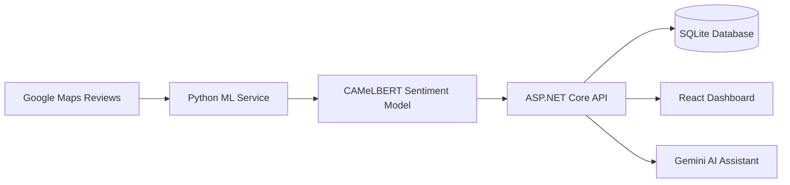

<div align="center">

# TOURALYZE

### AI-Powered Arabic Tourism Sentiment Analysis Platform

**Graduation Project — King Khalid University**


</div>

## Overview

TOURALYZE is an end-to-end tourism analytics platform built to transform large volumes of unstructured Arabic visitor reviews into clear, actionable insights. It collects reviews from Google Maps, processes Saudi dialect and colloquial Arabic with a fine-tuned transformer model, classifies sentiment, and presents the results through an interactive bilingual dashboard.

The platform supports tourism authorities, destination managers, researchers, and hospitality stakeholders in understanding visitor satisfaction, recurring themes, and destination performance.

## Key Features

- **Arabic sentiment analysis:** Classifies reviews as positive, neutral, or negative with confidence scores.
- **Saudi dialect support:** Uses a fine-tuned CAMeLBERT model designed for Saudi Google Maps reviews.
- **Automated review collection:** Ingests Google Maps reviews through Selenium WebDriver.
- **Tourism analytics:** Calculates sentiment proportions, average ratings, frequent keywords, and key topics.
- **Interactive dashboard:** Provides region, city, and report-level navigation across Saudi Arabia's 13 administrative regions.
- **Data visualization:** Includes Recharts charts, D3.js word clouds, and sentiment-based review filtering.
- **Bilingual experience:** Supports Arabic and English with automatic RTL/LTR layout adaptation.
- **Secure accounts:** Uses JWT authentication, BCrypt password hashing, and time-limited email OTP verification.
- **Report management:** Generates printable analytical reports with SHA256-based deduplication caching.
- **AI assistant:** Uses Google Gemini to summarize destination statistics and answer analytical questions.

## System Architecture



## Tech Stack

### Frontend

- React 19 and TypeScript
- Vite 6
- React Router DOM
- Recharts and D3.js
- Tailwind CSS and Vanilla CSS
- Lucide React

### Backend

- ASP.NET Core 8 Web API
- C# and .NET 8
- Entity Framework Core 8
- JWT Bearer authentication
- BCrypt.Net-Next
- Swagger / OpenAPI

### AI and Machine Learning

- Fine-tuned CAMeLBERT: `whrivt/camelbert-saudi-gmaps-sentiment`
- PyTorch and Hugging Face Transformers
- FastAPI and Uvicorn
- Five-stage Arabic text-normalization pipeline
- Google Gemini REST API

### Data and External Services

- SQLite
- Google Maps and Selenium WebDriver
- SMTP email service
- Google Gemini API

## Project Structure

```text
TOURALYZE/
├── App.tsx                    # Application layout and routes
├── src/
│   ├── components/            # Shared UI components
│   ├── context/               # Authentication and language state
│   ├── pages/                 # Application pages and dashboards
│   ├── services/              # API integration services
│   ├── translations/          # Arabic and English dictionaries
│   └── utils/                 # Geographic mapping utilities
├── SmartTourism.API/          # ASP.NET Core Web API
│   ├── Controllers/
│   ├── Data/
│   ├── DTOs/
│   ├── Models/
│   └── Services/
└── SmartTourism.ML/           # Python sentiment-analysis service
    ├── main.py
    └── requirements.txt
```

## Getting Started

### Prerequisites

- Node.js 18 or later
- npm 9 or later
- .NET SDK 8 or later
- Python 3.10 or later
- Google Chrome for Selenium-based review collection

### Installation

1. Clone the repository:

```bash
git clone https://github.com/Mhdi57/TOURALYZE.git
cd TOURALYZE
```

2. Install the frontend dependencies:

```bash
npm install
```

3. Set up the Python ML service:

```bash
cd SmartTourism.ML
python3 -m venv venv
source venv/bin/activate  # Windows: venv\Scripts\activate
pip install -r requirements.txt
cd ..
```

4. Restore the backend dependencies:

```bash
cd SmartTourism.API
dotnet restore
cd ..
```

## Configuration

Never commit API keys, tokens, passwords, or cryptographic secrets. For local development, configure secrets with the .NET Secret Manager:

```bash
cd SmartTourism.API
dotnet user-secrets set "GeminiApiKey" "<YOUR_GEMINI_API_KEY>"
dotnet user-secrets set "JwtSettings:Key" "<YOUR_SECURE_JWT_SECRET>"
```

For staging or production, use environment variables such as `GeminiApiKey` and `JwtSettings__Key`.

## Running the Application

Start the three services in separate terminals.

### 1. ML Service

```bash
cd SmartTourism.ML
source venv/bin/activate  # Windows: venv\Scripts\activate
uvicorn main:app --host 127.0.0.1 --port 8000 --reload
```

### 2. Backend API

```bash
cd SmartTourism.API
dotnet run
```

The Swagger interface is available at `http://localhost:5165/swagger`.

### 3. Frontend

```bash
npm run dev
```

The React application is available at `http://localhost:5173`.

## Security

- Secrets and credentials must remain outside source control.
- Local database files are excluded through `.gitignore`.
- Authentication uses signed JWTs and BCrypt password hashing.
- Production secrets should be supplied through secure environment variables or a secrets manager.

## Future Improvements

- Add streaming responses to the Gemini assistant.
- Expand sentiment classification to more regional Arabic dialects.
- Export reports directly to PDF and CSV.
- Add Docker Compose for unified multi-service deployment.
- Add automated testing and CI/CD workflows.

## Project and Attribution

TOURALYZE was developed collaboratively as a graduation project at **King Khalid University**. Team members contributed across the platform's research, design, development, AI, and integration work.

**Mahdi Aldossari** — Project team member and maintainer of this portfolio repository  
[GitHub](https://github.com/Mhdi57) · [LinkedIn](https://www.linkedin.com/in/mahdi-aldossari)

This repository is a maintained fork of the [original project repository](https://github.com/lq-p3/sentiment-analysis). The upstream repository and commit history preserve the project's original attribution and contributions.

## License

No open-source license has currently been specified. All rights are reserved by the project contributors.
